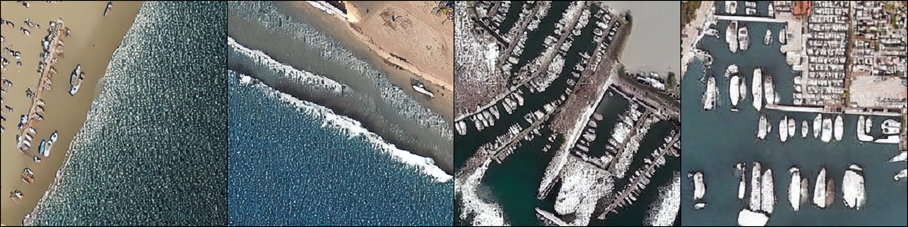
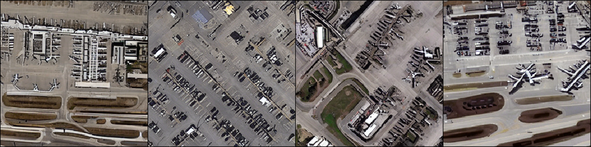
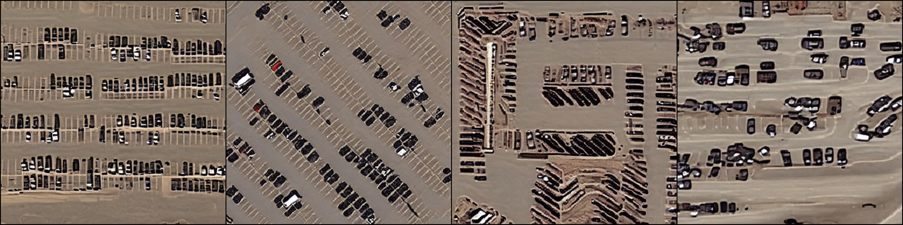
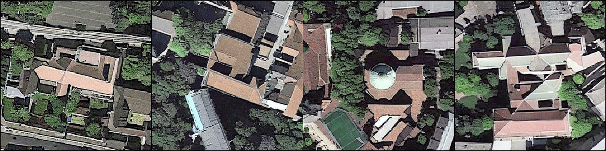

# Stable Diffusion for Remote Sensing Image Generation

#### Author: Zhiqiang yuan @ AIR CAS,  [Send a Email](yuan_zhi_qiang@sina.cn)
#### Welcome :+1:_<big>`Fork and Star`</big>_:+1:, then we'll let you know when we update
#### -------------------------------------------------------------------------------------

A simple project for `text-to-image remote sensing image generation`,
and we will release the code of `using multiple text to control regions for super-large RS image generation` later.
Also welcome to see the project of [image-condition fake sample generation](https://github.com/xiaoyuan1996/Controllable-Fake-Sample-Generation-for-RS) in [TGRS, 2023](https://ieeexplore.ieee.org/abstract/document/10105619/).

##  Environment configuration

Follow and thanks [original training repo](https://github.com/justinpinkney/stable-diffusion.git) .


## Pretrained weights

We used RS image-text dataset [RSITMD](https://github.com/xiaoyuan1996/AMFMN) as training data and fine-tuned stable diffusion for 10 epochs with 1 x A100 GPU.
When the batchsize is 4, the GPU memory consumption is about 40+ Gb during training, and about 20+ Gb during sampling.
The pretrain weights is realesed at [last-pruned.ckpt](https://drive.google.com/drive/folders/10vK3eNpIw7H3lxxZbB7NF2IZktGt95As?usp=sharing).

## Using

### Samling
Download the pretrain weights `last-pruned.ckpt` to current dir, and run with:
```commandline
python scripts/txt2img.py \
    --prompt 'Some boats drived in the sea' \
    --outdir 'outputs/RS' \
    --H 512 --W 512 \
    --n_samples 4 \
    --config 'configs/stable-diffusion/RSITMD.yaml' \
    --ckpt './last-pruned.ckpt'
```

### Traing
We will update the train code ASAP.

## Examples
**Caption:** `Some boats drived in the sea.`


**Caption:** `A lot of cars parked in the airport.`


**Caption:** `A large number of vehicles are parked in the parking lot, next to the bare desert.`


**Caption:** `There is a church in a dark green forest with two table tennis courts next to it.`

